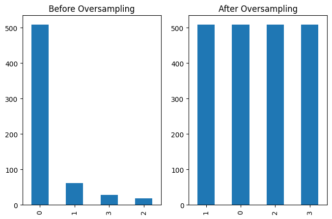
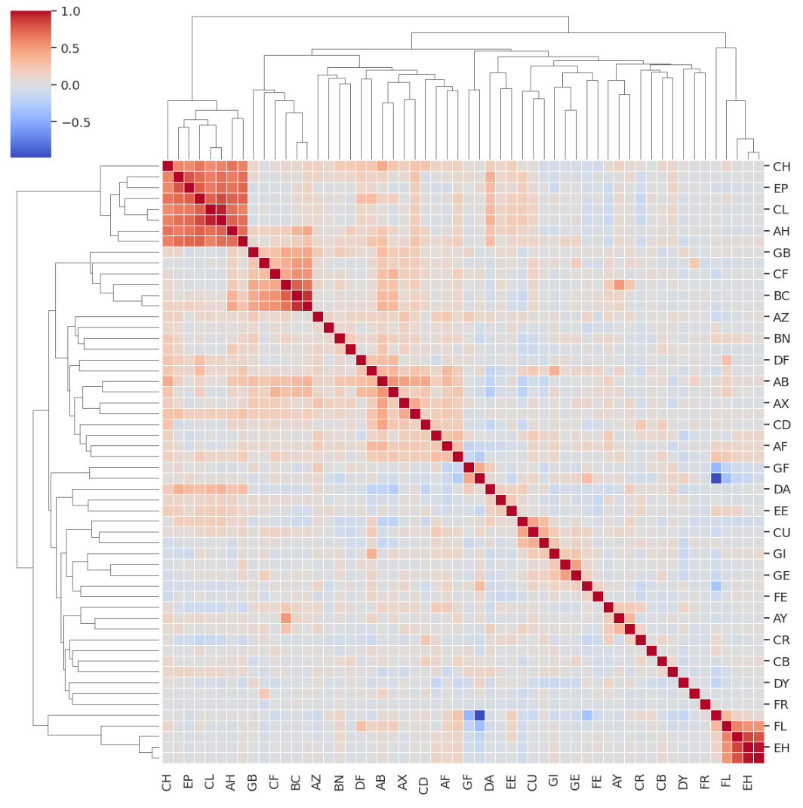
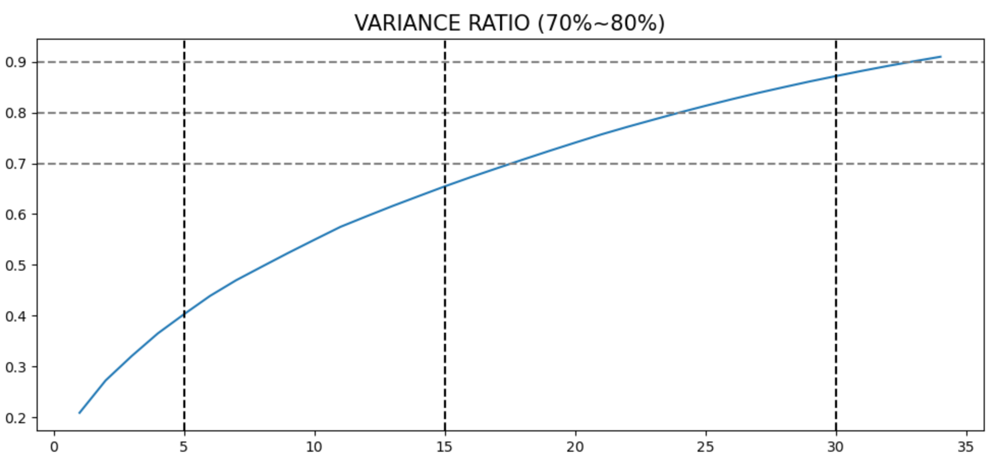

# Reference

# [Kaggle] ICR - Identifying Age-Related Conditions

# Label Encoder : ‘EJ’ column

- EJ 컬럼의 unique 값 A, B를 각각 0과 1로 변환
    - scikit-learn 의 preprocessing 함수 중 LabelEncoder() 사용 가능
- 그 외 ‘Id’ 및 ‘Class’ column 을 제외한 나머지 feature들은 모두 numeric한 값

---

# 결측치 처리: KNNImputer()

- 각 컬럼의 데이터는 익명화된 건강 특성을 의미하고, 이것이 숫자로 변환된 상태
- 따라서 각각의 숫자가 단순한 숫자가 아닌 특성을 나타내는 의미가 있기 때문에, 결측치를 보간하는 방법을 숫자의 특성이 반영될 수 있는 방법으로 사용하고자 함
- KNNImputer는 KNN(K-Nearest Neighbor)알고리즘을 사용하여 결측치를 보간하는 방식으로, 숫자의 거리에 따라 특성이 반영된다고 추측, 이를 통해 결측치를 보간하였음
    - scikit-learn의 패키지 중 하나로 결측치를 채우는 방법
    - 어떻게 채워야할 지 아이디어가 없을 때 주로 사용
- KNNImputer는 데이터에 문자열이 존재하지 않아야 하는데 유일한 string data였던 EJ 컬럼도 변환을 하였으므로, 모든 데이터가 numerical하게 되어 사용함
    - 고유값을 나타내는 변수 제거와 가변수화가 선행되어야 함
    
    [참고 링크](https://velog.io/@songjeongwoo/결측치-조치-aq300kcu)
    

---

# Scaler: StandardScaler()

- 범주형 데이터인 EJ 컬럼을 제외하고 스케일링 진행
    - EJ 컬럼의 A, B는 숫자의 의미가 아닌, 구분이 되는 특정 값으로 고정되어야 하기 때문
- scikit-learn 패키지의 StandardScaler를 사용해서 X_train, X_test 모두 스케일링
- StandardScaler는 평균이 0, 분산이 1인 정규분포를 띄도록 데이터를 표준화함
    
    [참고 링크](https://syj9700.tistory.com/56)
    

---

# Data Imbalacne: OverSampling

- 데이터에서 각 클래스(주로 범주형 반응 변수)가 갖고 있는 데이터의 양에 차이가 큰 경우, 클래스 불균형이 있다고 말한다.
    - 데이터 클래스 비율이 너무 차이가 나면(Highly-imbalanced Data) 단순히 우세한 클래스를 택하는 모형의 정확도가 높아지므로 모형의 성능판별이 어려워진다.
    - 즉,  정확도(accuracy)가 높아도 데이터 개수가 적은 클래스의 재현율(recall-rate)이 급격히 작아지는 현상이 발생한다.
- 불균형 데이터의 처리방법에는 ‘가중치 균형방법(Weighted Balancing)’, ‘Undersampling’, ‘Oversampling’ 방법이 있다.
- 이 중 이번 프로젝트는 Oversampling 으로 데이터 불균형을 처리한다.
    - Oversampling 은 소수 클래스의 복사본을 만들어, 대표클래스의 수만큼 데이터를 만들어 준다. 똑같은 데이터를 그대로 복사하는 것이기 때문에 새로운 데이터는 기존 데이터와 같은 성질을 갖는다.
    - 정보가 손실되지 않는다는 장점이 있으나, 과적합(over-fitting)을 초래할 수 있음
- 제공된 학습 데이터의 길이가 617개로 짧기 때문에, 정보의 손실을 방지하기 위해 Oversampling 을 사용한다.

---

# SMOTE(Synthetic Minority Over-Sampling Technique)

- oversampling 기법 중 SMOTE 사용
    - 낮은 비율로 존재하는 클래스의 데이터를 최근접 이웃(K-NN) 알고리즘을 활용하여 새롭게 생성하는 방법
    - 알고리즘을 기반으로 데이터를 생성하므로 과적합 발생 가능성이 단순 무작위 방법보다 적음. 따라서 과적합 발생 가능성을 가장 낮추기 위해 ‘SMOTE’ 기법을 사용함
    - 동작 방식
        1. 소수 클래스의 데이터 중 특정 벡터(샘플)와 가장 가까운 k개의 이웃 벡터를 선정
        2. 기준 벡터와 선정한 벡터 사이를 선분으로 이음
        3. 선분 위의 임의의 점이 새로운 벡터
    - 제공된 데이터 중 학습 데이터에 적용할 수 있는 greeks 테이블의 ‘Alpha’ column 을 기준으로 Oversampling 진행
        - Greeks: Alpha
            - 주어진 데이터셋 중 Greeks 데이터셋의 Alpha 컬럼은 연령 관련 조건의 유형을 식별하는 컬럼으로, 값은 A, B, D, G 총 4가지가 존재함
            - A는 나이와 관련된 조건은 없고, 클래스 0에 해당됨
            - B, D, G는 나이와 관련된 세 가지 조건, 클래스 1에 해당됨
            - Greeks의 데이터 중 Alpha 컬럼의 값들 만이 유일하게 Class(target)와 직접 연관이 있는 컬럼으로, 클래스 0에 해당하는 A 값이 데이터의 대부분을 차지하여 치중되어 있는 상태임
            - 따라서 0과 1을 구분하는 이진분류 시행 시, 클래스 비율을 맞춰주지 않으면 모델 학습이 잘 이뤄지지 않을 것으로 생각하여, Alpha 컬럼 데이터를 기준으로 oversampling하여 진행함
    
    [참고 링크](http://www.incodom.kr/SMOTE)
    

## OverSampling 결과



오버샘플링 전 shape 체크:  `(617,)` → 오버샘플링 후 shape 체크:  `(2036,)`

---

# 변수 선택: 일반(default), PCA, VIF

- 전처리 후 컬럼을 그대로 사용했을 때 총 56개의 컬럼인 상태
    - 데이터 탐색(EDA) 를 통해 독립변수(feature)간 상관관계가 높아 다중공선성이이 의심되는 feature 를 확인
        
        
        
- 다중공선성을 제거하여 모델이 데이터를 더 적합하게 학습하도록 PCA, VIF를 적용하여 변수를 제거하지 않았을 때와, PCA 및 VIF 를 적용하여 차원을 축소하였을 때의 Loss 값을 비교
    - Loss Function 은 대회에서 제시한 함수로 이하 ‘balanced_log_loss’로 표현
- 결과: PCA와 VIF를 적용하지 않은 일반(default)로 진행했을 때 결과 값이 가장 좋았음
⇒ 따라서 PCA, VIF 적용 배제하였음

## PCA와 VIF 비교 결과

|              | XGB      | LGBM     | CatBoost | RandomForest |
| ------------ | -------- | -------- | -------- | ------------ |
| 일반(Defult) | 1.000901 | 0.670095 | 0.890632 | 0.636166     |
| VIF          | 0.924561 | 0.678577 | 0.966972 | 0.814292     |
| PCA          | 1.246885 | 0.992418 | 1.348672 | 1.272332     |

## PCA(주성분 분석)

- PCA는 차원축소와 변수추출 기법으로 널리 쓰이고 있음
- 주성분: 전체 데이터(독립변수)들의 분산을 가장 잘 설명하는 성분
- 변수의 개수 = 차원의 개수
- 변수가 너무 많아 기존 변수를 조합해 새로운 변수를 가지고 모델링을 하려고 할 때 주로 PCA 사용
- PCA는 데이터를 1차원으로 축소하는 방법으로 정사영(projection)을 사용
    - 기존 2차원일 때는 거리를 두고 있던 점들이 차원이 축소되며 정사영 되면서 겹치게 되는 문제 발생 ⇒ 기존의 정보가 유실
    - 따라서 새로운 축을 찾아서 분산이 최대로 보존될 수 있도록 해야 함 ⇒ 이 때 새로운 축이 PC(Principal Component, 주성분)
    - PC를 찾기 위해 covariance matrix(공분산 행렬)의 eigen vector(고유 벡터) 값을 찾아야 하고, 이 값 중 가장 큰 값이 우리가 원하는 PC에 만족하는 값이 됨
- PCA의 변수 추출(Feature Extraction)은 기존 변수를 조합해 새로운 변수를 만드는 기법으로, 단순히 일부 중요 변수만을 빼내는 변수선택(Feature Selection)과는 대비되는 개념
    - PCA의 변수 추출은 기존 변수를 모두 사용하는 방식 ~ 기존 변수를 선형결합(linear combination)해 새로운 변수를 만들어 냄
- PCA 수행 과정
    1. mean centering
    2. SVD(Singular-value decomposition) 수행
    3. PC score 구하기
    4. PC score를 설명변수로 활용하여 분석을 진행
- 표준화
    - PCA를 하기 전에 데이터 스케일링을 하는 이유는 데이터의 스케일에 따라 주성분의 설명 가능한 분산량이 달라질 수 있기 때문 ~ StandardScaler
- PCA 코드
    
    ```python
    from sklearn.decomposition import PCA
    pca = PCA(n_components=35)
    pca.fit(X_train)
    X_train = pca.transform(X_train)
    X_test  = pca.transform(X_test)
    # 29번째까지 Explained Variance의 누적합이 0.861220 
    ```
    
    `X_train.shape (2036, 29)`
    
    
    
    [머신러닝 - PCA (Principal Component Analysis)](https://velog.io/@swan9405/PCA)
    

## VIF(Variance Inflation Factors, 분산팽창요인)

- 다중회귀모델에서 독립 변수간 상관 관계가 있는지 측정하는 척도: 다중공선성
- VIF가 10이 넘으면 다중공선성이 있다고 판단, 5가 넘으면 주의할 필요가 있는 것으로 봄
    - 독립 변수 a와 b가 서로 상관 관계가 있을 때 두 변수 모두 VIF가 높음 ~ 서로 연관 있는 변수들 간 VIF가 높음
- VIF 코드
    
    ```python
    def check_vif(df):
        vifs = [variance_inflation_factor(df, i) for i in range(df.shape[1])]
        vif_df = pd.DataFrame({"features":df.columns, "VIF" : vifs})
        vif_df = vif_df.sort_values(by="VIF", ascending=False)
        remove_col = vif_df.iloc[0, 0]
        top_vif = vif_df.iloc[0, 1]
        return vif_df, remove_col, top_vif
    
    top_vif = 100
    
    while(top_vif > 5):
        vif_df, remove_col, top_vif = check_vif(X_train)
        print(vif_df)
        print(remove_col, top_vif)
        if top_vif < 5:
             break
        X_train = X_train.drop(columns=remove_col)
    X_test = pd.DataFrame(data=X_test, columns=X_train.columns)
    ```
    
    `X_train.shape (2036, 51)`
    
    [참고 링크](https://bkshin.tistory.com/entry/DATA-20-다중공선성과-VIF)
    

---

# Cross Validation: StratifiedKFold

- 모든 데이터 셋을 평가에 활용하여 평가에 사용되는 데이터 편중을 막는다.
- 평가 결과에 따라 좀 더 일반화된 모델을 만들 수 있다.
    - 특정 케이스에 편중된 과적합 방지
- 모든 데이터 셋을 훈련에 활용하여 정확도를 향상시키고 데이터 부족으로 인한 underfitting 을 방지할 수 있다.

](Reference_img/Untitled%201.png)

[그림 출처](https://m.blog.naver.com/ckdgus1433/221599517834)

- 결과: Kfold 및 Multilabelstratifiedkfold를 적용했을 때보다 StratifiedKFold를 적용했을 때의 balanced_log_log 값이 더 좋았음 ⇒ 따라서 StratifiedKFold 사용

## KFold, StratifiedKFold,MultilabelstratifiedKFold 비교 결과

|                           | XGB      | LGBM     | CatBoost | RandomForest | 최종     |
| ------------------------- | -------- | -------- | -------- | ------------ | -------- |
| KFold                     | 0.746435 | 0.661613 | 0.916079 | 1.195992     | 0.508489 |
| StratifiedKFold           | 0.559826 | 0.585273 | 1.000901 | 1.128134     | 0.254244 |
| MultilabelstratifiedKFold | 0.661613 | 0.712506 | 1.119652 | 1.162062     | 0.677985 |

## KFold

- 교차검증을 위해서 가장 일반적으로 사용되는 방식

## StratifiedKFold

- 데이터셋을 학습/검증 셋으로 나눌 때 데이터셋의 class별 비율을 동일하게 가져가도록 하는 것
- Multi-class Classification(여러 개의 클래스 중 하나로 판별하는 문제)

## Multi-label Classification

- 여러 개의 클래스를 함께 판별하는 문제
- multi-label을 갖는 데이터들의 비율을 일정하게 나눌 수 있음
- MultilabelstratifiedKFold - greeks 테이블의 ‘Alpha’, ‘Beta’, ‘Gamma’, ‘Delta’ columns  기준.
    - *`(kf.split(X_train, greeks.iloc[:, 1:-1]))`*
    
    [참고 링크](https://cvml.tistory.com/25)
    

---

# Ensemble : CV Stacking

- 개별 모델이 예측한 데이터를 다시 training set으로 사용해서 학습
- 개별 모델: LGBMClassifier, CatBoostClassifier, HistGradientBoostingClassifier ,RandomForestClassifier
- 메타 모델: LGBMClassifier

원본 학습 데이터 Shape: `(2036, 56)` 원본 테스트 데이터 Shape: `(5, 56)` 
→ Stacking 학습 데이터 Shape: `(2036, 4)` Stacking 테스트 데이터 Shape: `(5, 4)`

[참고 링크](https://lsjsj92.tistory.com/558)

---

# Hyperparameter tuning

- 개별 모델의 최적의 하이퍼파라미터를 찾기 위해 Optuna, Flaml을 사용하여 탐색함